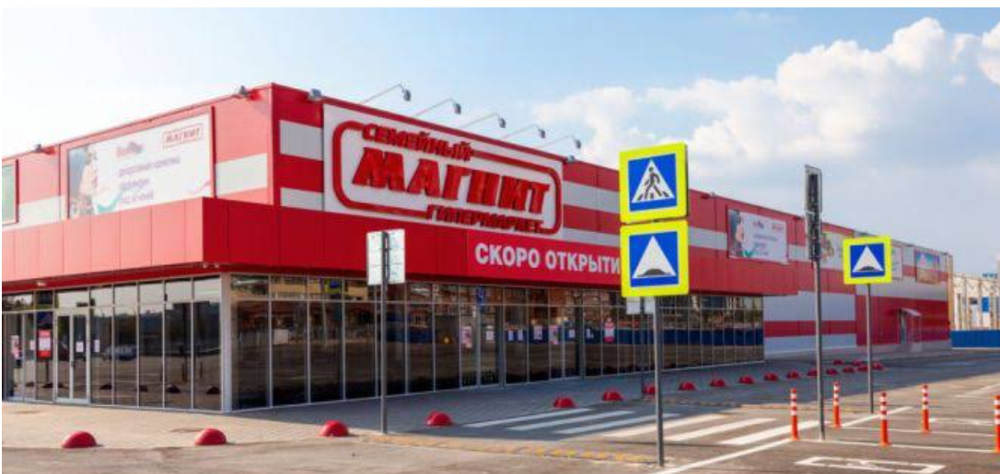

# Project 1- Goodride store Sales Analysis (Excel)

## Goodride Sales Analysis

## Introduction

This Excel projects provides a comprehensive overview of the purchase performance for an imaginary Bike store called **Goodride**, over a given period of time. The Bike sales dataset was organised and analyzed to answer crucial questions and gain insights to make strategc data driven decisions. This project includes organizing and analyzing purchase transactions, customer information, and product details of these datasets.

This report contains 3 pages:

You can interact with the project [here](https://1drv.ms/x/c/b8e8fdd319a907e1/Ebg3beouaVxHuwkvlOzeNTwBkKoIOB3kNqk36A8UMPK-jw?e=n9lQ7j&nav=MTVfe0QyMTdDMzlDLTZBMkEtNEE1QS04MUQxLUY3N0EwM0E1ODVFQ30)
- Raw dataset
- Worksheet
- Pivot table
- Dashboard

*__Disclaimer__* : **_All dataset or report do no represent any Company, Institution or Country but its justa dummy dataset used to demonstrate capabilities of Excel._**

## Problem Statement
- What is the Average income per Customers?
- Which region has the highest impact on the sales?
- What Age bracket purchased bike more?
- What is the Average distance of customers commute?

## Skills / Concept demonstrated
I used Power Query to clean and transform the data while using Power Pivot to analyse and create models. Other tools used includes; slicers, filters, DAX. Leveraging visualization tools, I created charts, graphs, and pivot tables to showcase key Performance metrics.

Filter                     |  Purchase
:------------------------: |  ----------------------------:
   : |  _:

## Analysis
- Average income by purchase

:
   
This chart shows that the male customers who bought bikes have a higher average income ($60,124) than female customers who made similar purchases, with an average income of $55,774.

- Customers Commute

  
This chart shows that most bike customers (200) commute between o-1 mile daily with the lowest at more than 10miles. 

- Sales by region
  

  
 This chart shows that North America has the highest no of customers (508), this implies that the highest income is enerated from this region, followed by Europe (300) and the pacific (196) respectively.

- sales by Age bracket
  

This chart shows that the Age bracket of the stores customers are middle aged (>31years), followed by the old (>55years) and the young (<31years) respectively. 

## Recommendation
- Diversifying the product selection to include bikes that appeal more to female customers is a great strategy for wider market
- monitor sales performance and customer feedback in Europe and the Pacific to identify areas for improvement and fine-tune strategies accordingly

## Conclusion

For making accurate data-driven decisions, datasets from previous years should be analyzed and results compared with current data to identify trends, patterns, and changes over time.

# Project 2- Choco-coffee-store-analysis (Excel)

## Introduction

This Excel projects provides a comprehensive overview of the purchase performance for an imaginary Coffee store called **Choco-Coffee**, over a given period of time. The Coffee sales dataset was organised and analyzed to answer crucial questions and gain insights to make strategc data driven decisions. This project includes organizing and analyzing purchase transactions, customer information, and product details of these datasets.

This report contains 3 pages:

You can interact with the project [here](https://1drv.ms/x/c/b8e8fdd319a907e1/EYsugyZJVs5HuXuTODvQqEABmSS1j892JrJL9GiM12BenA?e=aWfY35)

- Worksheet
- Dashboard

*__Disclaimer__* : **_All dataset or report do no represent any Company, Institution or Country but its justa dummy dataset used to demonstrate capabilities of Excel._**

### Problem Statement
- What is total revenue per month, and what month has the highest revenue?
- Which product sells the most?
- What day has the highest sales?
- What hour of the day is the rush hour?

### Skills / Concept demonstrated
I used Power Query to clean and transform the data while using Power Pivot to analyse and create models. Other tools used includes; slicers, filters, DAX. Leveraging visualization tools, I created charts, graphs, and pivot tables to showcase key Performance metrics.

## Chart
### filter -----------------------| -------------------------- Chart
----------|---------- 

## Analysis
- Total Revenue by Month
  

   
This chart shows the revenue generated between Jan - June. The highest at $56,957 and $27,821, it also shows that there is steady rise from february until June.

- Transaction by the Hour of the Day
  

This chart shows the hours of the day the store records the highest sales which is between 8hrs and 10hrs. The most sales is at the 10hrs, with 6957 transactions.

- Transaction by Day of the Week
  
 

  
- Transaction by Product Category
  

This chart shows highest selling product in the store. Coffee sells the highest (20187), followed by Tea (15277) and the Bakery (7617)

# Project 3- Super Store Sales Report (PowerBI)

## Introduction

This PowerBIprojects provides a comprehensive overview of the Sale performance for an imaginary departmental store called **Super Store**, over a given period of time. The store has 5 departments, Novelty, Supermarket, Gift, Corporate and Computer. The sales dataset was organised and analyzed to answer crucial questions and gain insights to make strategc data driven decisions to improve growth and performance. This project includes organizing and analyzing Invoice and customer information dataset.

You can interact with the project [here](https://app.powerbi.com/links/K-pMlojKy3?ctid=6ca78932-d96b-4bc9-a757-8cbc03f574b9&pbi_source=linkShare)

*__Disclaimer__* : **_All dataset or report do no represent any Company, Institution or Country but its justa dummy dataset used to demonstrate capabilities of PowerBI._**

## Problem Statement
- What is the total revenue generated?
- What is the sales per department?
- What is sales by province?
- What is the sum of quantity sold?

## Skills / Concept demonstrated
I used Power Query to clean and transform the data. Other tools used includes; slicers, filters, Quick measures. Leveraging visualization tools, I created charts, graphs, and pivot tables to showcase key Performance metrics.

## Chart

## Analysis

### Sales by Departmental Category 

This chart reports the total sales value for each departmental category and shows that the highest sales is generated from the Novelty shop ($38m)

### Sales by month

This chart shows the sales value for each month, from January to December. I created two measures, Year to Year percentage (YtoY%) change and sales Year to Date (YtoD) calculation as shown in the table to make comparison with the previous year. The highest quantity sold is recorded in July (267k)

### Sum of Sales by Province

This chart shows the stores sales performance by province. You can drill down into each state/province to identify the individual performance. from this analysis, Texas has the highest sales at #3,564,577

## Recommendation
- Gather customer feedback to identify painpoints and reasons for not shopping at the oher departments
- Explore cross selling strategy by encouraging customers who purchase from the Novelty shop to explore complementary products from other sections at discounted prices. everyone loves discounts!
- Gather customer feedback to identify painpoints and reasons for not shopping at the oher departments
- Allocate more marketing efforts, and inventory to the other departmental category
